# SmartHub Diagnostics — ERD (Crow’s Foot)

SmartHub diagnostics persistence is now **Supabase-only** for saved diagnostic results. Supabase uses **PostgreSQL** as the database engine (with `jsonb` payload storage in `public.diagnostic_runs`).

The ERD below is a **conceptual/logical model** mapped to the current Supabase-backed design.

```mermaid
erDiagram
  USER ||--o{ DIAGNOSTIC_RUN : owns
  DEVICE ||--o{ DIAGNOSTIC_RUN : has
  DIAGNOSTIC_RUN ||--o{ DIAGNOSTIC_STAGE : includes
  DIAGNOSTIC_RUN ||--o{ DIAGNOSTIC_FINDING : emits
  DIAGNOSTIC_RUN ||--o| RUN_COUNTS : summarizes

  DIAGNOSTIC_RUN ||--o| BATTERY_DETAIL : has
  DIAGNOSTIC_RUN ||--o| DISPLAY_DETAIL : has
  DIAGNOSTIC_RUN ||--o| TOUCH_DETAIL : has
  DIAGNOSTIC_RUN ||--o| SENSORS_DETAIL : has
  DIAGNOSTIC_RUN ||--o| CAMERA_DETAIL : has
  DIAGNOSTIC_RUN ||--o| CONNECTIVITY_DETAIL : has
  DIAGNOSTIC_RUN ||--o| HARDWARE_DETAIL : has
  DIAGNOSTIC_RUN ||--o| SYSTEM_DETAIL : has
  DIAGNOSTIC_RUN ||--o| OS_DETAIL : has

  DEVICE ||--o{ ON_DEVICE_REPORT : produces
  DIAGNOSTIC_RUN ||--o| SCREEN_TEST_IMAGE : captures

  DEVICE ||--o{ DEVICE_APP : has
  APP ||--o{ DEVICE_APP : installed_as
  DEVICE_APP ||--o{ APP_PERMISSION : requests
  DEVICE_APP ||--o| APP_RISK_ASSESSMENT : scored_as
  DEVICE_APP ||--o| APK_DEEP_SCAN : analyzed_by
  DEVICE_APP ||--o{ SUSPICIOUS_APP_FLAG : flagged_as

  SMARTLINK_CONFIG ||--o{ SMARTLINK_PAIRING : contains
  SMARTLINK_PAIRING ||--o{ SMARTLINK_CHALLENGE : issues

  USER {
    uuid owner_user_id PK
    string email
  }

  DEVICE {
    string device_id PK
    string device_label
    string connection_type
    string model
    string brand
  }

  DIAGNOSTIC_RUN {
    bigint id PK
    uuid owner_user_id FK
    string diagnostic_type
    string device_id FK
    bigint run_id
    bigint run_timestamp
    jsonb payload
    timestamptz created_at
  }

  RUN_COUNTS {
    number run_id PK, FK
    number high
    number medium
    number low
  }

  DIAGNOSTIC_STAGE {
    number stage_id PK
    number run_id FK
    string stage_key
    boolean ok
    string label
    string details
  }

  DIAGNOSTIC_FINDING {
    number finding_row_id PK
    number run_id FK
    string finding_id
    string title
    string severity
    string details
  }

  BATTERY_DETAIL {
    number run_id PK, FK
    string name
    number level
    number temperatureC
    string health
    number capacityMah
    number cycleCount
    string chargingEfficiency
  }

  DISPLAY_DETAIL {
    number run_id PK, FK
    number width
    number height
    number diagonalInches
    number areaCm2
  }

  TOUCH_DETAIL {
    number run_id PK, FK
    boolean hasTouchDriverErrors
    boolean hasInputAnomalies
    boolean isChargingDuringLogs
  }

  SENSORS_DETAIL {
    number run_id PK, FK
    number sensorCount
    boolean hasAccelerometer
    boolean hasGyroscope
    boolean hasBarometer
    boolean hasMagnetometer
    boolean hasProximitySensor
  }

  CAMERA_DETAIL {
    number run_id PK, FK
    number descriptorCount
  }

  CONNECTIVITY_DETAIL {
    number run_id PK, FK
    boolean hasWifi
    boolean hasBluetooth
    boolean hasNfc
    boolean hasGps
    boolean hasMobile
  }

  HARDWARE_DETAIL {
    number run_id PK, FK
    boolean hasFingerprint
    boolean hasNfc
    boolean hasAccelerometer
    boolean hasGyroscope
    boolean hasMicrophone
    boolean hasSpeaker
    boolean hasProximitySensor
  }

  SYSTEM_DETAIL {
    number run_id PK, FK
    boolean hasStorageIssue
    boolean hasCrashIssue
    number memTotalKb
  }

  OS_DETAIL {
    number run_id PK, FK
    boolean hasFsError
    boolean hasVerityIssue
    boolean hasCoreServiceCrashes
    string androidVersion
    string buildFingerprint
    boolean isCustomBuild
    string verifiedBootState
    boolean bootloaderLocked
  }

  SCREEN_TEST_IMAGE {
    string image_id PK
    number run_id FK
    string image_path
    string image_url
  }

  ON_DEVICE_REPORT {
    string report_id PK
    string device_id FK
    string source_path
    string json_payload
  }

  APP {
    string package_name PK
    string display_name
    string path
    boolean is_system
  }

  DEVICE_APP {
    string device_app_id PK
    string device_id FK
    string package_name FK
    number code_bytes
    number data_bytes
    number total_bytes
    string installer
  }

  APP_PERMISSION {
    string device_app_id FK
    string permission_name
  }

  APP_RISK_ASSESSMENT {
    string device_app_id PK, FK
    string risk_level
    number risk_score
  }

  APK_DEEP_SCAN {
    string device_app_id PK, FK
    string risk
    string summary
    string raw_json
  }

  SUSPICIOUS_APP_FLAG {
    string flag_id PK
    string device_app_id FK
    string threat_level
    string reason
  }

  SMARTLINK_CONFIG {
    string config_id PK
    string file_path
  }

  SMARTLINK_PAIRING {
    string pairing_id PK
    string config_id FK
    string public_key_pem
    boolean defaultEnableAdb
    boolean defaultEnableUsbTethering
  }

  SMARTLINK_CHALLENGE {
    string challenge_id PK
    string pairing_id FK
    number created_at
    string challenge_bytes
  }
```

## Notes (mapping to this codebase)

- **Database type**: Supabase PostgreSQL (managed Postgres).
- **History storage**: `DIAGNOSTIC_RUN` is persisted in Supabase table `public.diagnostic_runs` (`owner_user_id`, `diagnostic_type`, `device_id`, `run_id`, `run_timestamp`, `payload` as `jsonb`, `created_at`).
- **Stages/details**: In the app today, `diagStages` and `diagDetails` are stored as nested JSON objects on the run; the ERD shows a normalized view so crow’s-foot relationships are explicit.
- **SmartLink config**: Pairings are persisted in `%APPDATA%/SmartHubDiagnostics/smartlink-config.json` (`src/serverContext.ts`). Challenges are in-memory (`smartLinkChallenges` map).
- **Apps/security scan**: Apps, permissions, risk, deep-scan results, and suspicious flags are computed per request (mostly not persisted unless included in a saved run’s `textReport`).
